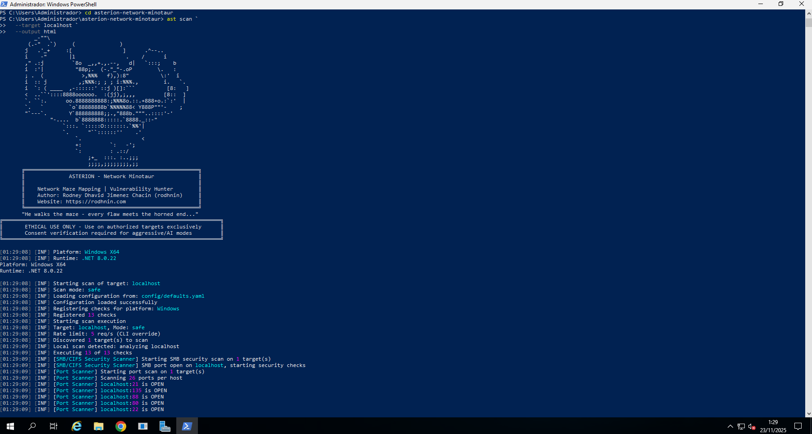
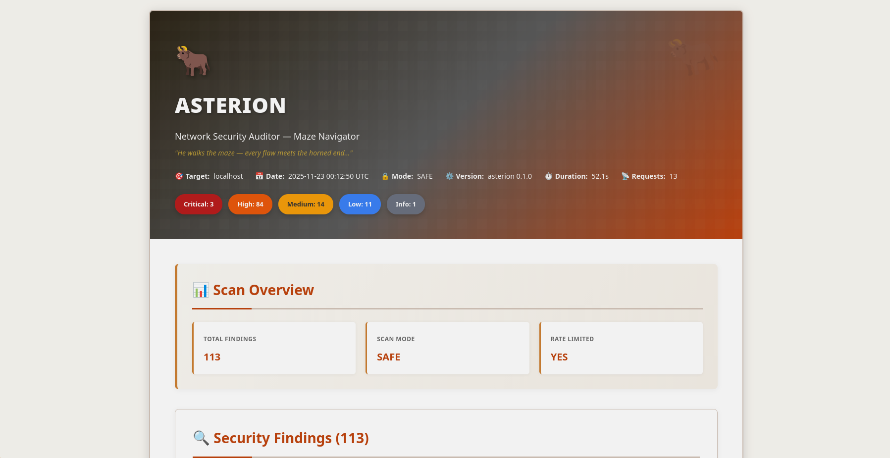
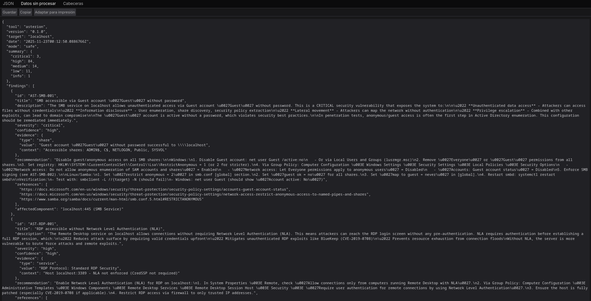

# Asterion — Network Security Auditor with AI-Powered Analysis

````
                        _-""\
                      (.-"  .`)     (              )
                      j   .'_+     :[                ]      .^--..
                      i    -"       |l                .    /      i
                      ," .:j         `8o  _,,+.,.--,   d|   `:::;    b
                      i  :'|          "88p;.  (-."_"-.oP        \.   :
                      ; .  (            >,%%%   f),):8"          \:'  i
                      i  :: j          ,;%%%:; ; ; i:%%%.,        i.   `.
                      i  `: ( ____  ,-::::::' ::j )[]:```          [8:   ]
                      <  ..``'::::8888oooooo.  :(jj),;,,,         [8::  ]
                      `. ``:.      oo.8888888888:;%%%8o.::.+888+o.:`:'  |
                      `.   `        `o`88888888b`%%%%%88< Y888P""'-    ;
                      "`---`.       Y`888888888;;.,"888b."""..::::'-'
                              "-....  b`8888888:::::.`8888._::-"
                                  `:::. `:::::O:::::::.`%%'|
                                  `.      "``::::::''    .'
                                      `.                   <
                                      +:         `:   -';
                                      `:         : .::/
                                          ;+_  :::. :..;;;
                                          ;;;;,;;;;;;;;,;;
                    ╔═══════════════════════════════════════════════════════╗
                    ║              ASTERION — Network Minotaur              ║
                    ║                                                       ║
                    ║    Network Maze Mapping | Vulnerability Hunter        ║
                    ║    Author: Rodney Dhavid Jimenez Chacin (rodhnin)     ║
                    ║    Website: https://rodhnin.com                       ║
                    ╚═══════════════════════════════════════════════════════╝
                    "He walks the maze — every flaw meets the horned end..."
              ╔═════════════════════════════════════════════════════════════════════╗
              ║       ETHICAL USE ONLY - Use on authorized targets exclusively      ║
              ║       Consent verification required for aggressive/AI modes         ║
              ╚═════════════════════════════════════════════════════════════════════╝
````

<div align="center">


**Ethical network and domain security auditor with AI-powered analysis**

[🚀 Quick Start](#-quick-start) •
[📖 Documentation](docs/) •
[🐳 Docker](#-docker-deployment) •
[🤖 AI Features](#-ai-powered-analysis) •
[⭐ Star Us](https://github.com/rodhnin/asterion-network-minotaur)

</div>

---

## 🎬 Demo

### Scanner in Action

<div align="center">
  

_Demo showing:_

-   CLI execution with real-time progress indicators
-   Network vulnerability detection and evidence collection
-   HTML report generation with findings
</div>

---

## 📸 Screenshots

### Console Execution

<div align="center">
  

_Real-time scan execution showing network security findings_

</div>

### HTML Report

<div align="center">
  

_Beautiful HTML report with:_

-   🎨 Minotaur-themed design with dark grown/gray tones
-   🏷️ Color-coded severity badges (Critical, High, Medium, Low, Info)
-   📝 Expandable evidence sections showing SMB shares, LDAP queries, and network artifacts
-   🤖 AI-generated remediation guides (technical + executive modes)
-   📊 Network topology and vulnerability classification
</div>

### JSON Report

<div align="center">
  

_Machine-readable JSON report for:_

-   🤖 Programmatic processing and automation
-   📈 Historical analysis and trending
-   🔍 Detailed findings with network evidence and vulnerability data
</div>

---

## 🎯 What is Asterion?

Asterion is a production-ready **network and domain security auditor** that puts **ethics first**. Built for penetration testers, security researchers, and enterprise security teams, it combines traditional vulnerability scanning with cutting-edge AI analysis to deliver actionable insights for Windows Active Directory, Linux systems, and network infrastructure.

### Why Asterion?

-   **🔒 Ethical by Design**: Consent token system prevents unauthorized scanning
-   **🤖 AI-Powered**: GPT-4, Claude, or local Ollama for intelligent remediation guides
-   **📊 Professional Reports**: Beautiful HTML (Minotaur-themed) + machine-readable JSON
-   **🚀 Fast & Efficient**: Multi-threaded scanning with intelligent rate limiting
-   **💾 Persistent Tracking**: Shared SQLite database with Argos Suite for scan history
-   **🐳 Docker Ready**: Containerized scanning for CI/CD integration

### What It Scans

| Check Category            | Details                                                                     |
| ------------------------- | --------------------------------------------------------------------------- |
| **SMB/CIFS Security**     | Anonymous shares, SMB signing, SMBv1 (EternalBlue), NTLMv1, writable shares |
| **RDP Security**          | Network Level Authentication (NLA), encryption levels, exposed RDP          |
| **LDAP/Active Directory** | Anonymous bind, LDAP signing, password policies, Kerberos pre-auth          |
| **Kerberos Security**     | AS-REP roasting, Kerberoasting, excessive ticket lifetime                   |
| **SNMP**                  | Default community strings, SNMPv1/v2c, write access                         |
| **DNS/NetBIOS**           | Zone transfers (AXFR), LLMNR/NetBIOS poisoning, mDNS                        |
| **Windows Systems**       | Firewall, Registry (UAC, LSA), services, privilege escalation               |
| **Linux Systems**         | iptables/nftables, SSH, Samba/NFS, SUID binaries, sudo misconfig            |

---

## ✨ Features

### 🛡️ Core Network Security Scanning

```bash
# One command, comprehensive network analysis
ast scan --target 10.0.0.0/24 --output html
```

-   **Multi-Method Detection**: SMB, RDP, LDAP, Kerberos, SSH, FTP, DNS, SNMP protocol analysis
-   **Multi-Threading**: Concurrent scanning with 1-20 worker threads
-   **Smart Rate Limiting**: Configurable request throttling (1-20 req/s) to avoid detection
-   **Evidence Collection**: SMB shares, LDAP queries, PowerShell output preserved

### 🤖 AI-Powered Analysis

Choose your AI provider based on your needs:

| Provider             | Best For           | Speed           | Cost          | Privacy         |
| -------------------- | ------------------ | --------------- | ------------- | --------------- |
| **OpenAI GPT-4**     | Production quality | ⚡ Fast (40s)   | 💰 $0.30/scan | 🔒 Standard     |
| **Anthropic Claude** | Privacy-focused    | ⚡ Fast (50s)   | 💰 $0.35/scan | 🔒 Enhanced     |
| **Ollama (Local)**   | Complete privacy   | 🐢 Slow (30min) | 💰 Free       | 🔐 100% Offline |

**Two Analysis Modes:**

-   **Technical**: Step-by-step remediation with PowerShell/GPO commands and configuration snippets
-   **Executive**: Plain-language summaries for stakeholders and management

### 📊 Professional Reporting

**JSON Reports** (Machine-Readable)

```json
{
  "tool": "asterion",
  "version": "0.1.0",
  "target": "10.0.0.0/24",
  "summary": {
    "critical": 12,
    "high": 8,
    "medium": 15,
    "low": 5,
    "info": 20
  },
  "findings": [...]
}
```

**HTML Reports** (Human-Friendly)

-   🎨 Minotaur-themed design (red/orange/purple color scheme)
-   🏷️ Color-coded severity badges
-   📝 Expandable evidence sections (SMB shares, LDAP queries, PowerShell output)
-   🤖 AI analysis beautifully formatted
-   📱 Mobile-friendly responsive design

### 🔐 Consent Token System

Asterion enforces ethical hacking through technology. Aggressive scanning and AI analysis require **proof of ownership**:

```bash
# 1. Generate token
ast consent generate --domain corp.local

# 2. Place token (choose one method)
# HTTP: Upload to https://corp.local/.well-known/verify-abc123.txt
# DNS: Add TXT record: corp.local = "asterion-verify=verify-abc123"
# SSH: Create file /tmp/consent_verify-abc123 with token content

# 3. Verify ownership
ast consent verify --method http --domain corp.local --token verify-abc123

# 4. Now you can use aggressive mode
ast scan --target corp.local --mode aggressive --use-ai
```

### 💾 Database Persistence

Shared SQLite database with Argos Suite tracks everything:

-   **Scan History**: Date, duration, findings count, severity breakdown
-   **Finding Repository**: Searchable vulnerability database across all Argos tools
-   **Verified Domains**: Consent token tracking with expiration
-   **Trend Analysis**: Compare scans over time

```bash
# Query recent scans (works for all Argos Suite tools)
sqlite3 ~/.argos/argos.db "SELECT * FROM scans WHERE tool='asterion' ORDER BY started_at DESC LIMIT 10"

# Find critical issues
sqlite3 ~/.argos/argos.db "SELECT * FROM v_critical_findings WHERE tool='asterion'"
```

---

## 🚀 Quick Start

### Prerequisites

**All Platforms:**

-   **.NET 8.0 SDK** ([Download](https://dotnet.microsoft.com/download/dotnet/8.0))
-   **Python 3.10+** ([Download](https://www.python.org/downloads/))
-   **git** (for cloning the repository)

**Optional:**

-   **Docker** (for containerized scanning)
-   **API Keys** (for AI analysis - OpenAI or Anthropic)

### Installation — Automated Setup (Recommended)

#### Linux / macOS

```bash
# Clone repository
git clone https://github.com/rodhnin/asterion-network-minotaur.git
cd asterion-network-minotaur

# Run setup script
chmod +x scripts/setup.py
python3 scripts/setup.py
```

**The script will:**

1. ✅ Check prerequisites (.NET, Python)
2. ✅ Install Python dependencies
3. ✅ Setup the shared Argos Suite database
4. ✅ Build Asterion in Release mode
5. ✅ Create directories (~/.asterion, ~/.argos)
6. ✅ Create wrapper script `/usr/local/bin/ast` (optional)

#### Windows (PowerShell)

```powershell
# Clone repository
git clone https://github.com/rodhnin/asterion-network-minotaur.git
cd asterion-network-minotaur

# Run setup (right-click PowerShell > Run as Administrator)
.\scripts\setup.ps1
```

**The script will:**

1. ✅ Check prerequisites (.NET, Python)
2. ✅ Install Python dependencies
3. ✅ Setup the shared Argos Suite database
4. ✅ Build Asterion in Release mode
5. ✅ Create directories (%USERPROFILE%\.asterion, %USERPROFILE%\.argos)

### Installation — Manual Setup

If the automated scripts don't work on your system, follow these steps:

#### Step 1: Clone repository

```bash
git clone https://github.com/rodhnin/asterion-network-minotaur.git
cd asterion-network-minotaur
```

#### Step 2: Install dependencies

**Linux/macOS:**

```bash
pip3 install -r scripts/requirements.txt
```

**Windows (Command Prompt):**

```cmd
pip install -r scripts\requirements.txt
```

#### Step 3: Setup database

**Linux/macOS:**

```bash
python3 scripts/db_migrate.py
```

**Windows:**

```cmd
python scripts\db_migrate.py
```

#### Step 4: Build Asterion

**All Platforms:**

```bash
dotnet build -c Release
```

#### Step 5: Create config directories

**Linux/macOS:**

```bash
mkdir -p ~/.asterion/reports
mkdir -p ~/.asterion/consent-proofs
mkdir -p ~/.argos
```

**Windows (PowerShell):**

```powershell
New-Item -ItemType Directory -Force -Path "$env:USERPROFILE\.asterion\reports" | Out-Null
New-Item -ItemType Directory -Force -Path "$env:USERPROFILE\.asterion\consent-proofs" | Out-Null
New-Item -ItemType Directory -Force -Path "$env:USERPROFILE\.argos" | Out-Null
```

#### Step 6: (Linux/macOS only) Create global command

```bash
# Create wrapper script
sudo nano /usr/local/bin/ast
# Paste this content:

#!/bin/bash
exec dotnet "$(cd "$(dirname "${BASH_SOURCE[0]}")/.." && pwd)/src/Asterion/bin/Release/net8.0/Asterion.dll" "$@"

# Make executable
sudo chmod +x /usr/local/bin/ast
```

#### Step 7: Configure API keys (optional)

**For OpenAI:**

```bash
export OPENAI_API_KEY="sk-..."
```

**For Anthropic Claude:**

```bash
export ANTHROPIC_API_KEY="sk-ant-..."
```

**Windows (PowerShell):**

```powershell
$env:OPENAI_API_KEY = "sk-..."
# Or permanently:
[Environment]::SetEnvironmentVariable("OPENAI_API_KEY", "sk-...", [System.EnvironmentVariableTarget]::User)
```

#### Step 8: Verify installation

**Linux/macOS (if symlink was created):**

```bash
ast version
```

**Windows or direct invocation:**

```cmd
.\src\Asterion\bin\Release\net8.0\ast.exe version
# Or with dotnet
dotnet .\src\Asterion\bin\Release\net8.0\Asterion.dll version
```

### Your First Scan

#### Auto-Scanning Local Network

**Asterion can automatically discover and scan your local network!**

**Windows (PowerShell) — After Setup (Recommended):**

```powershell
# Test on localhost (simple)
ast scan --target localhost --output html

# Scan local subnet with AI analysis
ast scan --target 192.168.1.0/24 --output both --threads 10 --rate 5 --use-ai --ai-tone both

# Domain scan with authentication
ast scan --target corp.local --auth "CORP\admin:Password123" --use-ai
```

**Windows (PowerShell) — Without PATH Setup:**

```powershell
# Scan localhost (full path)
.\src\Asterion\bin\Release\net8.0\ast.exe scan `
  --target localhost `
  --output html `
  --use-ai `
  --ai-tone both

# Scan local subnet (full path)
.\src\Asterion\bin\Release\net8.0\ast.exe scan `
  --target 192.168.1.0/24 `
  --output both `
  --threads 10 `
  --rate 5
```

**Linux/macOS:**

```bash
# Scan localhost
ast scan --target localhost \
  --output html \
  --use-ai \
  --ai-tone both

# Scan local subnet (e.g., 192.168.1.0/24)
ast scan --target 192.168.1.0/24 \
  --output both \
  --threads 10 \
  --rate 5

# Scan domain
ast scan --target corp.local \
  --auth "CORP\admin:Password123" \
  --output html \
  --use-ai
```

#### Output Formats

Asterion supports three output formats using `--output`:

| Format   | Command         | Output                             |
| -------- | --------------- | ---------------------------------- |
| **JSON** | `--output json` | Machine-readable reports (default) |
| **HTML** | `--output html` | Beautiful Minotaur-themed reports  |
| **Both** | `--output both` | Generate both JSON and HTML        |

#### AI Tone Options

Control how AI analysis is formatted using `--ai-tone`:

| Tone              | Use Case          | Output                                                |
| ----------------- | ----------------- | ----------------------------------------------------- |
| **technical**     | Security teams    | Step-by-step remediation with PowerShell/GPO commands |
| **non_technical** | Executive summary | Plain-language descriptions for management            |
| **both**          | Complete analysis | Both technical and executive formats                  |

#### Basic Examples

**Simple network scan (no authentication):**

```bash
ast scan --target 10.0.0.0/24
```

**With HTML report:**

```bash
ast scan --target 192.168.1.0/24 --output html
```

**Authenticated scan (Windows domain):**

```bash
ast scan --target dc01.corp.local \
  --auth "CORP\Administrator:P@ssw0rd" \
  --output html
```

**With AI analysis (technical + executive):**

```bash
ast scan --target 10.0.0.0/24 \
  --use-ai \
  --ai-tone both \
  --output html
```

**Fast scanning (10 threads, 10 req/s):**

```bash
ast scan --target 10.0.0.0/24 \
  --threads 10 \
  --rate 10 \
  --output json
```

#### Report Locations

**Native Installation:**

-   Reports: `~/.asterion/reports/`
-   Database: `~/.argos/argos.db`

**Windows:**

-   Reports: `%USERPROFILE%\.asterion\reports\`
-   Database: `%USERPROFILE%\.argos\argos.db`

**Docker Deployment:**

-   Reports: `docker/reports/`
-   Database: `docker/data/argos.db`

**🎉 Success!** Check the reports directory for JSON and HTML output files.

---

### Running on Docker

**Automatic Deployment:**

```bash
cd docker
./deploy.sh    # Linux/macOS
.\deploy.ps1   # Windows
```

**Manual Docker Deployment:**

```bash
# Build and start
docker compose up -d

# Run a scan
docker compose exec asterion dotnet /app/ast.dll scan \
  --target 192.168.1.0/24 \
  --output html

# View logs
docker compose logs -f asterion

# Stop services
docker compose down
```

---

## 📘 Usage Guide

### Command Structure

```bash
ast <command> [options]
```

**Available Commands:**

-   `scan` — Run a security scan
-   `consent` — Manage consent tokens
-   `version` — Display version information

### Scan Command Options

| Option          | Values                         | Default      | Description                                                        |
| --------------- | ------------------------------ | ------------ | ------------------------------------------------------------------ |
| `--target, -t`  | IP/CIDR/domain                 | **Required** | Target to scan (e.g., `192.168.1.0/24`, `localhost`, `corp.local`) |
| `--mode, -m`    | safe, aggressive               | `safe`       | Scan mode (aggressive requires consent)                            |
| `--output, -o`  | json, html, both               | `json`       | Output format                                                      |
| `--ports, -p`   | port list                      | Auto-detect  | Ports to scan (e.g., `22,80,443` or `8000-9000`)                   |
| `--threads`     | 1-20                           | 5            | Number of concurrent threads                                       |
| `--rate`        | 1-20                           | 5            | Request rate limit (req/s)                                         |
| `--timeout`     | seconds                        | 10           | Connection timeout                                                 |
| `--use-ai`      | flag                           | false        | Enable AI-powered analysis                                         |
| `--ai-tone`     | technical, non_technical, both | technical    | AI analysis format                                                 |
| `--auth`        | user:pass                      | -            | Domain credentials (format: `DOMAIN\user:pass`)                    |
| `--auth-ntlm`   | user:hash                      | -            | NTLM hash (format: `user:hash`)                                    |
| `--kerberos`    | user:pass@REALM                | -            | Kerberos credentials                                               |
| `--ssh`         | user:pass                      | -            | SSH credentials for Linux auditing                                 |
| `--verify-ssl`  | true, false                    | true         | Verify SSL certificates                                            |
| `--verbose, -v` | flag                           | false        | Enable verbose logging                                             |

### Quick Reference Examples

#### Basic Scanning

```bash
# Scan local subnet (default: JSON output, safe mode)
ast scan --target 192.168.1.0/24

# Scan with HTML report
ast scan --target 192.168.1.0/24 --output html

# Scan specific IP
ast scan --target 10.0.0.5 --output both
```

#### Network Targeting

```bash
# CIDR notation
ast scan --target 10.0.0.0/24

# IP range
ast scan --target 192.168.1.10-50

# Domain name
ast scan --target corp.local

# Single host
ast scan --target 192.168.1.1
```

#### Performance Tuning

```bash
# Slow, stealthy scan (3 threads, 2 req/s)
ast scan --target 10.0.0.0/24 --threads 3 --rate 2

# Fast scan (15 threads, 15 req/s)
ast scan --target 10.0.0.0/24 --threads 15 --rate 15

# Specific ports only
ast scan --target 10.0.0.0/24 --ports 445,3389,22,139
```

#### Windows Domain Scanning

```bash
# Basic authenticated scan
ast scan --target dc01.corp.local \
  --auth "CORP\Administrator:P@ssw0rd"

# With NTLM hash (Pass-the-Hash)
ast scan --target 10.0.0.5 \
  --auth-ntlm "admin:aad3b435b51404eeaad3b435b51404ee:8846f7eaee8fb117ad06bdd830b7586c"

# With Kerberos
ast scan --target dc.corp.local \
  --kerberos "admin:password@CORP.LOCAL"

# Full domain audit with AI analysis
ast scan --target corp.local \
  --auth "CORP\admin:P@ssw0rd" \
  --use-ai \
  --ai-tone both \
  --output html
```

#### Linux System Auditing

```bash
# Remote Linux SSH scan
ast scan --target 10.0.0.25 --ssh "admin:password"

# SSH with output
ast scan --target 10.0.0.25 \
  --ssh "root:toor" \
  --output html
```

#### AI-Powered Analysis

```bash
# Technical remediation (for security teams)
ast scan --target 10.0.0.0/24 \
  --use-ai \
  --ai-tone technical \
  --output html

# Executive summary (for management)
ast scan --target 10.0.0.0/24 \
  --use-ai \
  --ai-tone non_technical \
  --output html

# Both formats
ast scan --target 10.0.0.0/24 \
  --use-ai \
  --ai-tone both \
  --output both
```

#### Debugging

```bash
# Verbose output
ast scan --target 10.0.0.5 -v

# Verbose + custom timeout
ast scan --target 10.0.0.5 -v --timeout 20

# Test connectivity only (timeout 5s)
ast scan --target 10.0.0.5 --timeout 5
```

### Consent Token Management

#### Generate Consent Token

```bash
ast consent generate --domain corp.local
# Output: Token: verify-a3f9b2c1d8e4f5a6
```

#### Verify Consent (3 Methods)

**HTTP Method** (place file on web server):

```bash
# 1. Create file at: https://corp.local/.well-known/verify-a3f9b2c1d8e4f5a6.txt
# 2. Verify:
ast consent verify \
  --method http \
  --domain corp.local \
  --token verify-a3f9b2c1d8e4f5a6
```

**DNS Method** (add TXT record):

```bash
# 1. Add DNS TXT record: corp.local = "asterion-verify=verify-a3f9b2c1d8e4f5a6"
# 2. Verify:
ast consent verify \
  --method dns \
  --domain corp.local \
  --token verify-a3f9b2c1d8e4f5a6
```

**SSH Method** (create file on system):

```bash
# 1. Create file: /tmp/consent_verify-a3f9b2c1d8e4f5a6
# 2. Verify:
ast consent verify \
  --method ssh \
  --domain corp.local \
  --token verify-a3f9b2c1d8e4f5a6 \
  --ssh "user:password"
```

#### Run Aggressive Mode

```bash
# After verifying consent token:
ast scan --target corp.local --mode aggressive
```

### Real-World Scenarios

#### Scenario 1: Quick Network Assessment

```bash
# Fast, no-auth scan with HTML report
ast scan --target 192.168.1.0/24 --output html --threads 10 --rate 10
```

#### Scenario 2: Full Domain Audit

```bash
# Complete Windows AD assessment with AI analysis
ast scan --target corp.local \
  --auth "CORP\admin:P@ssw0rd" \
  --use-ai \
  --ai-tone both \
  --output both \
  --threads 8 \
  --rate 8
```

#### Scenario 3: Stealth Scanning

```bash
# Slow, careful scan to avoid detection
ast scan --target 10.0.0.0/24 \
  --threads 2 \
  --rate 1 \
  --timeout 20 \
  --output json
```

#### Scenario 4: Penetration Testing

```bash
# Generate consent first
ast consent generate --domain internal.corp

# Place token and verify
ast consent verify --method http --domain internal.corp --token <token>

# Run aggressive assessment
ast scan --target internal.corp \
  --mode aggressive \
  --auth "CORP\pentest:P@ssw0rd" \
  --use-ai \
  --output both
```

---

## 🤖 AI-Powered Analysis

Asterion uses **LangChain 1.0.0** with support for multiple AI providers via Python bridge, giving you flexibility based on your security, privacy, and budget requirements.

### Supported Providers

#### OpenAI GPT-4 Turbo

**Best for: Production use**

-   ⭐ Quality: Excellent (5/5)
-   ⚡ Speed: ~40 seconds
-   💰 Cost: ~$0.30 per scan
-   🔒 Privacy: Standard (data encrypted in transit)

```bash
export OPENAI_API_KEY="sk-..."
```

#### Anthropic Claude

**Best for: Enhanced privacy**

-   ⭐ Quality: Excellent (5/5)
-   ⚡ Speed: ~50 seconds
-   💰 Cost: ~$0.35 per scan
-   🔒 Privacy: Enhanced (Anthropic's privacy-first approach)

```bash
export ANTHROPIC_API_KEY="sk-ant-..."
```

#### Ollama (Local Models)

**Best for: Complete privacy**

-   ⭐ Quality: Good (3/5)
-   🐢 Speed: ~30 minutes (CPU) or ~90 seconds (GPU)
-   💰 Cost: Free
-   🔐 Privacy: 100% offline (data never leaves your machine)

```bash
# Install Ollama: https://ollama.ai
ollama pull llama3.2
```

### Privacy & Security

**Automatic Sanitization**
Before sending data to AI providers, Asterion automatically removes:

-   ✅ Consent tokens
-   ✅ Domain credentials (passwords, NTLM hashes)
-   ✅ Personal Identifiable Information (PII)
-   ✅ Internal IP addresses (when requested)
-   ✅ SMB share paths with sensitive data

**Opt-In Only**

-   AI analysis requires explicit `--use-ai` flag
-   Aggressive scanning requires verified consent token
-   You control which provider sees your data

**For Maximum Privacy**
Use Ollama locally. While slower and less accurate, your scan data never leaves your machine.

### Switching Providers

**Current Method (v0.1.0):** Edit `config/defaults.yaml`

```yaml
ai:
    langchain:
        provider: "ollama" # Changed from "openai"
        model: "llama3.2" # Ollama model
        ollama_base_url: "http://localhost:11434"
```

**Coming in v0.3.0:** Interactive configuration menu (Metasploit-style)

```bash
# Future feature
ast --show-options
ast --set ai.provider=anthropic
ast --save-profile privacy-mode
```

---

## 🧪 Safe Testing Lab

**⚠️ NEVER scan production networks without written permission!**

Use our Docker lab to practice safely:

### Setup Test Environment

```bash
# Navigate to docker directory
cd docker

# Deploy vulnerable network lab
docker-compose -f compose.testing.yml up -d

# Wait for services to start (~60 seconds)
docker-compose -f compose.testing.yml logs -f

# Create vulnerable conditions
docker-compose -f compose.testing.yml exec windows-target powershell -c "Disable-NetFirewallProfile -All"
```

### Scan the Lab

```bash
# Return to project root
cd ..

# Run scan against lab network
ast scan --target 172.20.0.0/24 --output html

# Try authenticated scan
ast scan --target 172.20.0.2 --auth "LAB\admin:P@ssw0rd123" --output both

# Try AI analysis (requires API key)
ast scan --target 172.20.0.0/24 --use-ai --output html
```

### Cleanup

```bash
cd docker
docker-compose -f compose.testing.yml down -v  # -v removes all data
```

For detailed testing scenarios, see [docs/TESTING_GUIDE.md](docs/TESTING_GUIDE.md)

---

## 🔒 Ethics & Legal

### The Golden Rule

**Only scan networks and systems you own or have explicit written permission to test.**

### Consent Enforcement

Asterion implements **technical controls** to prevent misuse:

| Mode            | Checks                       | Consent Required | Rate Limit |
| --------------- | ---------------------------- | ---------------- | ---------- |
| **Safe**        | Non-intrusive network checks | ❌ No            | 5 req/s    |
| **Aggressive**  | Deep AD/system testing       | ✅ Yes           | 10 req/s   |
| **AI Analysis** | Vulnerability analysis       | ✅ Yes           | N/A        |

### Legal Framework

Unauthorized access to computer systems is **illegal** in most jurisdictions:

-   🇺🇸 **USA**: Computer Fraud and Abuse Act (CFAA)
-   🇬🇧 **UK**: Computer Misuse Act 1990
-   🇪🇺 **EU**: Directive 2013/40/EU
-   🌍 **International**: Various cybercrime laws

### Best Practices

1. ✅ **Get written authorization** before scanning
2. ✅ **Define scope clearly** (which networks/domains/IPs)
3. ✅ **Document everything** (consent, findings, remediation)
4. ✅ **Use safe mode first** to establish baseline
5. ✅ **Report findings responsibly** (coordinated disclosure)
6. ❌ **Never exploit vulnerabilities** without explicit permission (e.g., no EternalBlue exploitation)
7. ❌ **Never scan third-party networks** (e.g., google.com, microsoft.com)

For complete ethical guidelines, see [docs/ETHICS.md](docs/ETHICS.md)

---

## 🐳 Docker Deployment

### Interactive Deployment Scripts (Recommended)

Asterion provides cross-platform deployment scripts:

**Linux/macOS:**

```bash
cd docker
./deploy.sh
```

**Windows (PowerShell):**

```powershell
cd docker
.\deploy.ps1
```

**Deployment Options:**

1. **Production** - Deploy Asterion Scanner
2. **Stop all services**
3. **Remove all containers and data** (reset)

### Manual Docker Deployment

**Linux/macOS:**

```bash
cd docker
docker compose up -d

# Execute scans (note the dotnet wrapper)
docker compose exec asterion dotnet /app/ast.dll scan --target 10.0.0.0/24

# View logs
docker compose logs -f asterion

# Stop service
docker compose down
```

**Windows (PowerShell):**

```powershell
cd docker
docker compose up -d

# Execute scans (note the dotnet wrapper)
docker compose exec asterion dotnet /app/ast.dll scan --target 10.0.0.0/24

# View logs
docker compose logs -f asterion

# Stop service
docker compose down
```

**Persistent data:**

-   Reports: `./reports/` → host directory `docker/reports/`
-   Database: `./data/argos.db` → host directory `docker/data/argos.db` (shared Argos Suite DB)
-   Logs: `./logs/asterion.log` → host directory `docker/logs/asterion.log`

**Note:** Asterion automatically detects Docker environment via `ASTERION_IN_DOCKER` environment variable.

**For complete Docker documentation (Linux/Windows), see:** [docker/README.md](docker/README.md)

---

## 📊 Understanding Reports

### Report Structure

**Native Installation:**

```
~/.asterion/
├── reports/
│   ├── asterion_report_10_0_0_0_24_20251117_143000.json  # Machine-readable
│   └── asterion_report_10_0_0_0_24_20251117_143000.html  # Human-friendly (Minotaur-themed)
└── consent-proofs/
    └── corp_local_verify-abc123_20251117.txt

~/.argos/
├── argos.db          # Shared Argos Suite database
└── logs/
    └── argos.log     # Shared log file
```

**Docker Deployment:**

```
asterion-network-minotaur/
├── docker/
│   ├── reports/
│   │   ├── asterion_report_10_0_0_0_24_20251117_143000.json
│   │   └── asterion_report_10_0_0_0_24_20251117_143000.html
│   ├── data/
│   │   └── argos.db          # Shared Argos Suite database (Docker)
│   ├── logs/
│   │   └── asterion.log
│   └── workspace/
│       └── consent-proofs/
```

**Note:** Docker environment is automatically detected via `ASTERION_IN_DOCKER` environment variable.

### JSON Report Schema

```json
{
    "tool": "asterion",
    "version": "0.1.0",
    "target": "10.0.0.0/24",
    "date": "2025-11-17T14:30:00Z",
    "mode": "safe",
    "summary": {
        "critical": 12,
        "high": 8,
        "medium": 15,
        "low": 5,
        "info": 20
    },
    "findings": [
        {
            "id": "AST-SMB-003",
            "title": "SMBv1 enabled (EternalBlue vulnerability)",
            "severity": "critical",
            "confidence": "high",
            "description": "SMBv1 is enabled on this system. This protocol is vulnerable to EternalBlue (CVE-2017-0143), a critical remote code execution vulnerability exploited by WannaCry ransomware.",
            "evidence": {
                "type": "smb",
                "value": "SMBv1 negotiated successfully",
                "context": "Port 445/tcp open, SMB signing not required"
            },
            "recommendation": "URGENT - Disable SMBv1 immediately:\n\nPowerShell:\nDisable-WindowsOptionalFeature -Online -FeatureName SMB1Protocol -NoRestart\n\nGroup Policy:\nComputer Configuration → Administrative Templates → MS Security Guide\n→ Configure SMBv1 client driver startup = Disabled\n→ Configure SMBv1 server = Disabled\n\nVerify:\nGet-SmbServerConfiguration | Select EnableSMB1Protocol",
            "references": [
                "https://docs.microsoft.com/en-us/windows-server/storage/file-server/troubleshoot/detect-enable-and-disable-smbv1-v2-v3",
                "https://nvd.nist.gov/vuln/detail/CVE-2017-0143"
            ],
            "affected_component": "SMB Server"
        },
        {
            "id": "AST-LDAP-001",
            "title": "LDAP anonymous bind allowed",
            "severity": "high",
            "confidence": "high",
            "description": "LDAP server allows anonymous bind, permitting unauthenticated enumeration of domain users, groups, and configuration.",
            "evidence": {
                "type": "ldap",
                "value": "Anonymous bind successful to port 389/tcp",
                "context": "Retrieved domain base DN: DC=corp,DC=local"
            },
            "recommendation": "Disable LDAP anonymous bind:\n\nGroup Policy:\nComputer Configuration → Policies → Windows Settings → Security Settings → Local Policies → Security Options\n→ Network access: Allow anonymous SID/Name translation = Disabled\n→ Network access: Do not allow anonymous enumeration of SAM accounts = Enabled\n→ Network access: Do not allow anonymous enumeration of SAM accounts and shares = Enabled\n\nRegistry:\nreg add \"HKLM\\SYSTEM\\CurrentControlSet\\Control\\Lsa\" /v RestrictAnonymous /t REG_DWORD /d 1 /f",
            "affected_component": "LDAP Server"
        },
        {
            "id": "AST-RDP-001",
            "title": "RDP without Network Level Authentication (NLA)",
            "severity": "high",
            "confidence": "high",
            "description": "Remote Desktop Protocol (RDP) is configured without Network Level Authentication (NLA). This allows unauthenticated attackers to reach the login screen and attempt brute-force attacks.",
            "evidence": {
                "type": "rdp",
                "value": "RDP port 3389/tcp open, NLA not required",
                "context": "Encryption level: High"
            },
            "recommendation": "Enable Network Level Authentication:\n\nPowerShell:\n(Get-WmiObject -class Win32_TSGeneralSetting -Namespace root\\cimv2\\terminalservices -Filter \"TerminalName='RDP-tcp'\").SetUserAuthenticationRequired(1)\n\nGroup Policy:\nComputer Configuration → Administrative Templates → Windows Components → Remote Desktop Services → Remote Desktop Session Host → Security\n→ Require user authentication for remote connections by using Network Level Authentication = Enabled",
            "affected_component": "RDP Server"
        }
    ],
    "notes": {
        "scan_duration_seconds": 67.5,
        "targets_scanned": 12,
        "rate_limit_applied": true,
        "scope_limitations": "Scan limited to network services. Local system checks require SSH/WinRM credentials.",
        "false_positive_disclaimer": "Manual verification recommended for all findings before remediation."
    },
    "aiAnalysis": {
        "executiveSummary": "The network scan identified 12 critical security vulnerabilities requiring immediate attention...",
        "technicalRemediation": "### Critical Issues\n\n1. **SMBv1 Enabled (EternalBlue)**\n   - Affected systems: 10.0.0.5, 10.0.0.10\n   - Remediation: Disable SMBv1...",
        "generatedAt": "2025-11-17T14:35:00Z",
        "modelUsed": "gpt-4-turbo-preview",
        "provider": "openai"
    }
}
```

### HTML Report Features

-   **📊 Executive Dashboard**: Summary cards with severity counts and Minotaur branding
-   **🤖 AI Analysis**: Expandable sections for executive and technical insights
-   **🔍 Detailed Findings**: Organized by severity with PowerShell/GPO remediation commands
-   **📋 Evidence**: SMB shares, LDAP queries, RDP configurations, PowerShell output
-   **🔗 External References**: Links to CVE, Microsoft documentation, OWASP guides
-   **📱 Mobile Responsive**: Works on all devices
-   **🎨 Minotaur Theme**: Red/orange/purple color scheme

---

## 📁 Project Structure

```
asterion-network-minotaur/
│
├── src/
│   ├── Asterion/                     # Main C# application
│   │   ├── Asterion.csproj           # .NET project file
│   │   │
│   │   ├── Checks/                   # Security check modules
│   │   │   ├── ICheck.cs             # Check interface (65 lines)
│   │   │   ├── BaseCheck.cs          # Abstract base class (350 lines)
│   │   │   │
│   │   │   ├── CrossPlatform/        # Network service scanners (work from any OS)
│   │   │   │   ├── PortScanner.cs    # TCP port scanning
│   │   │   │   ├── SmbScanner.cs     # SMB/CIFS security (42KB)
│   │   │   │   ├── RdpScanner.cs     # RDP configuration (24KB)
│   │   │   │   ├── LdapScanner.cs    # LDAP/AD security (38KB)
│   │   │   │   ├── KerberosScanner.cs # Kerberos security (22KB)
│   │   │   │   ├── SnmpScanner.cs    # SNMP vulnerabilities (21KB)
│   │   │   │   ├── DnsScanner.cs     # DNS misconfigurations (14KB)
│   │   │   │   └── FtpScanner.cs     # FTP security (27KB)
│   │   │   │
│   │   │   ├── Windows/              # Local Windows system checks
│   │   │   │   ├── WinFirewallCheck.cs # Firewall configuration
│   │   │   │   ├── WinRegistryCheck.cs # Registry security
│   │   │   │   ├── AdPolicyCheck.cs    # Active Directory policies
│   │   │   │   ├── WinServicesCheck.cs # Service misconfigurations
│   │   │   │   └── PrivEscCheckWin.cs  # Windows privilege escalation
│   │   │   │
│   │   │   └── Linux/                # Local/remote Linux checks (via SSH)
│   │   │       ├── LinuxFirewallCheck.cs # iptables/nftables/ufw
│   │   │       ├── SshConfigCheck.cs     # SSH hardening
│   │   │       ├── SambaNfsCheck.cs      # Samba/NFS security
│   │   │       └── PrivEscCheckLinux.cs  # SUID, sudo misconfig
│   │   │
│   │   ├── Core/                     # Core infrastructure
│   │   │   ├── Orchestrator.cs       # Main execution engine (1,243 lines)
│   │   │   ├── Config.cs             # YAML configuration loader
│   │   │   ├── ScanOptions.cs        # Scan configuration (24 lines)
│   │   │   ├── Database.cs           # SQLite operations
│   │   │   ├── ConsentValidator.cs   # Consent token verification
│   │   │   ├── SshConnectionManager.cs # SSH.NET wrapper
│   │   │   │
│   │   │   ├── Output/
│   │   │   │   └── ReportBuilder.cs  # Report generation
│   │   │   │
│   │   │   └── Utils/
│   │   │       ├── NetworkUtils.cs   # Network operations
│   │   │       ├── CidrParser.cs     # CIDR/IP range parsing
│   │   │       └── AuthenticationManager.cs # Credential handling
│   │   │
│   │   ├── Models/                   # Data models
│   │   │   ├── Report.cs             # Main report structure (150 lines)
│   │   │   ├── Finding.cs            # Security finding (126 lines, fluent API)
│   │   │   ├── Evidence.cs           # Finding proof
│   │   │   ├── ConsentInfo.cs        # Consent verification
│   │   │   └── AiAnalysis.cs         # AI-generated content
│   │   │
│   │   ├── Program.cs                # Application entry point (164 lines)
│   │   └── Cli.cs                    # CLI argument parser (527 lines)
│   │
│   └── Asterion.sln                  # Visual Studio solution
│
├── scripts/                          # Python bridge scripts
│   ├── ai_analyzer.py                # LangChain AI integration
│   ├── db_migrate.py                 # Database setup
│   ├── render_html.py                # HTML report generation (Jinja2)
│   ├── setup.py                      # Installation script
│   ├── setup.ps1                     # Windows PowerShell setup
│   └── requirements.txt              # Python dependencies (22 packages)
│
├── config/                           # Configuration files
│   ├── defaults.yaml                 # Default settings (321 lines)
│   └── prompts/                      # AI prompt templates
│       ├── technical.txt             # Technical remediation prompts
│       └── non_technical.txt         # Executive summary prompts
│
├── db/
│   └── migrate.sql                   # Database schema (shared with Argos Suite)
│
├── docker/                           # Docker deployment
│   ├── Dockerfile                    # Production image
│   ├── docker-compose.yml            # Production deployment
│   ├── compose.testing.yml           # Vulnerable lab environment
│   ├── .dockerignore
│   ├── .env.example
│   └── README.md                     # Docker instructions (80 lines)
│
├── docs/                             # Documentation
│   ├── AI_INTEGRATION.md             # AI setup guide (748 lines)
│   ├── CONSENT.md                    # Consent token system
│   ├── DATABASE_GUIDE.md             # SQLite schema and queries
│   ├── ETHICS.md                     # Ethical guidelines
│   ├── NETWORK_CHECKS.md             # Complete check catalog (50+ checks)
│   └── ROADMAP.md                    # Development roadmap
│
├── schema/
│   └── report.schema.json            # Argos Suite unified schema (240 lines)
│
├── templates/
│   └── report.html.j2                # HTML report template (35KB, Minotaur-themed)
│
├── assets/
│   └── ascii.txt                     # Minotaur ASCII art banner
│
├── CHANGELOG.md                      # Version history (104 lines)
├── LICENSE                           # MIT License
└── README.md                         # This file
```

**Statistics:**

-   **Total C# files**: 37 files (4,050 lines of code)
-   **Total Python files**: 4 files
-   **Platform**: Cross-platform (.NET 8.0)
-   **Language**: C# (primary), Python (AI bridge)

---

## 🗺️ Roadmap

### v0.1.0 — Initial Release ✅ (November 2025)

**Status:** 🎉 **Released**

-   ✅ 50+ security checks (SMB, RDP, LDAP, Kerberos, Windows, Linux)
-   ✅ AI-powered analysis (OpenAI, Anthropic, Ollama)
-   ✅ Consent token system (HTTP + DNS + SSH verification)
-   ✅ Professional reporting (JSON + HTML with Minotaur branding)
-   ✅ Shared Argos Suite database
-   ✅ Docker support
-   ✅ Cross-platform (.NET 8.0)

### v0.2.0 — Remote System Auditing (Q2 2026)

**Focus:** WinRM support, enhanced SSH, OS detection, aggressive mode

-   🔜 **WinRM Remote Windows Checks**: Audit Windows servers from Linux/macOS
-   🔜 **Enhanced SSH**: Key authentication, bastion hosts, sudo elevation
-   🔜 **OS Detection**: Per-target OS detection for automatic check selection
-   🔜 **Aggressive Mode**: AD enumeration (AS-REP roasting, delegation, ACLs)
-   🔜 **AI Cost Tracking**: Budget limits, token usage monitoring
-   🔜 **AI Streaming**: Real-time progress for long analyses
-   🔜 **Enhanced HTML Reports**: CVE/CWE badges, PowerShell/GPO snippets

### v0.3.0 — Enterprise Features (Q3 2026)

**Focus:** Usability, scale, interactive AI

-   🔜 **Metasploit-Style CLI**: Interactive config management (`--show-options`, `--set`)
-   🔜 **Database CLI**: No SQL required (`ast db scans list`, `ast db findings search`)
-   🔜 **Multi-Network Scanning**: Batch processing from file
-   🔜 **AI Chat Interface**: Conversational vulnerability analysis with BloodHound integration
-   🔜 **CI/CD Integration**: GitHub Actions, Jenkins, GitLab templates
-   🔜 **REST API Server**: ASP.NET Core API for automation

### v0.4.0 — Intelligence & Automation (Q4 2026)

**Focus:** Automated remediation, ML detection, distributed scanning

-   🔜 **Automated Remediation**: PowerShell DSC + Ansible playbook generation
-   🔜 **ML-Based Detection**: Anomaly detection, false positive reduction
-   🔜 **Distributed Scanning**: Worker nodes for large-scale environments
-   🔜 **Advanced AI Agents**: BloodHound query generation, attack path analysis

For detailed feature descriptions, see [docs/ROADMAP.md](docs/ROADMAP.md)

---

## 🤝 Contributing

We welcome contributions! Whether it's:

-   🐛 Bug reports
-   💡 Feature requests
-   📝 Documentation improvements
-   🔧 Code contributions

### How to Contribute

1. **Fork the repository**
2. **Create a feature branch** (`git checkout -b feature/amazing-feature`)
3. **Make your changes**
4. **Write/update tests** (when applicable)
5. **Commit your changes** (`git commit -m 'Add amazing feature'`)
6. **Push to the branch** (`git push origin feature/amazing-feature`)
7. **Open a Pull Request**

### Development Setup

```bash
# Clone your fork
git clone https://github.com/YOUR-USERNAME/asterion-network-minotaur.git
cd asterion-network-minotaur

# Install dependencies
pip install -r scripts/requirements.txt
dotnet restore

# Build solution
dotnet build

# Run with debugging
dotnet run --project src/Asterion -- scan --target 192.168.1.1 -v
```

### Code Style

-   **C# Formatting**: Follow Microsoft C# coding conventions
-   **Python Formatting**: We use [Black](https://github.com/psf/black) (line length: 88)
-   **XML Documentation**: Required for all public classes/methods
-   **Code Comments**: Use `//` for inline comments, `///` for XML docs

### Reporting Issues

Found a bug? Have a feature request?

**Open an issue**: https://github.com/rodhnin/asterion-network-minotaur/issues

Please include:

-   Asterion version (`ast version`)
-   .NET version (`dotnet --version`)
-   Python version (`python --version`)
-   Operating system
-   Steps to reproduce (for bugs)
-   Expected vs actual behavior

---

## 📚 Documentation

Comprehensive documentation available in the `docs/` directory:

| Document                                    | Description                               |
| ------------------------------------------- | ----------------------------------------- |
| [AI_INTEGRATION.md](docs/AI_INTEGRATION.md) | Complete AI setup guide (all 3 providers) |
| [CONSENT.md](docs/CONSENT.md)               | Consent token system technical details    |
| [DATABASE_GUIDE.md](docs/DATABASE_GUIDE.md) | SQLite schema, queries, management        |
| [ETHICS.md](docs/ETHICS.md)                 | Legal framework and ethical guidelines    |
| [NETWORK_CHECKS.md](docs/NETWORK_CHECKS.md) | Complete catalog of 50+ security checks   |
| [ROADMAP.md](docs/ROADMAP.md)               | Future features and development plans     |

### Quick Links

-   **Changelog**: [CHANGELOG.md](CHANGELOG.md)
-   **License**: [LICENSE](LICENSE)
-   **ASCII Art**: [assets/ascii.txt](assets/ascii.txt)

---

## 🤝 Part of Argos Suite

Asterion is the fourth component of the **Argos Security Suite**:

| Tool           | Language    | Target                  | Status      |
| -------------- | ----------- | ----------------------- | ----------- |
| **Argus**      | Python      | WordPress               | ✅ Stable   |
| **Hephaestus** | Python      | Servers (Linux/Windows) | ✅ Stable   |
| **Pythia**     | Python      | SQL Injection           | ✅ Stable   |
| **Asterion**   | C# + Python | Networks/Domains/AD     | 🎉 Released |

**Shared Infrastructure:**

-   SQLite database (`~/.argos/argos.db`)
-   Unified JSON report schema
-   Consent token system
-   AI analysis via LangChain

---

## ⚖️ License

This project is licensed under the **MIT License** - see the [LICENSE](LICENSE) file for details.

```
MIT License

Copyright (c) 2025 Rodney Dhavid Jimenez Chacin

Permission is hereby granted, free of charge, to any person obtaining a copy
of this software and associated documentation files (the "Software"), to deal
in the Software without restriction, including without limitation the rights
to use, copy, modify, merge, publish, distribute, sublicense, and/or sell
copies of the Software, and to permit persons to whom the Software is
furnished to do so, subject to the following conditions:

The above copyright notice and this permission notice shall be included in all
copies or substantial portions of the Software.

THE SOFTWARE IS PROVIDED "AS IS", WITHOUT WARRANTY OF ANY KIND, EXPRESS OR
IMPLIED, INCLUDING BUT NOT LIMITED TO THE WARRANTIES OF MERCHANTABILITY,
FITNESS FOR A PARTICULAR PURPOSE AND NONINFRINGEMENT.
```

---

## ⚠️ Disclaimer

**IMPORTANT:** This tool is for **authorized security testing only**.

### Legal Notice

By using Asterion, you acknowledge and agree that:

1. ✅ You will **only scan networks/systems you own** or have **explicit written permission** to test
2. ✅ You will **comply with all applicable laws** and regulations
3. ✅ You understand that **unauthorized access is illegal** (CFAA, Computer Misuse Act, etc.)
4. ✅ The author and contributors **assume no liability** for misuse
5. ✅ This software is provided **"as-is" without warranty** of any kind

### Responsible Disclosure

If you discover vulnerabilities using Asterion:

-   📧 Contact the network/system owner privately first
-   ⏰ Give reasonable time to fix (typically 90 days)
-   🤝 Coordinate disclosure timeline
-   📝 Document your findings professionally

### When in Doubt

**Don't scan.** If you're unsure whether you have permission, you probably don't.

---

## 🙏 Acknowledgments

Asterion stands on the shoulders of giants:

-   **Microsoft** — .NET platform and security documentation
-   **BloodHound** — AD security research and attack path analysis
-   **OWASP** — Security standards (Top 10, Testing Guide, ASVS)
-   **SMBLibrary** — Pure C# SMB implementation by Tal Aloni
-   **SSH.NET** — SSH protocol implementation for .NET
-   **DnsClient.NET** — DNS client library by Michael Conrad
-   **LangChain** — AI framework that powers intelligent analysis
-   **Anthropic & OpenAI** — AI models for vulnerability analysis
-   **Ollama** — Local AI inference for privacy-focused scanning

Special thanks to all security researchers who practice and promote ethical hacking.

---

## 👤 Author

**Rodney Dhavid Jimenez Chacin (rodhnin)**

-   🌐 Website & Contact: [rodhnin.com](https://rodhnin.com)
-   💼 GitHub: [@rodhnin](https://github.com/rodhnin)
-   🐦 Twitter: [@rodhnin](https://twitter.com/rodhnin)

For questions, feedback, or collaboration inquiries, please visit [rodhnin.com](https://rodhnin.com)

---

## 💬 Community

-   **Discussions**: [GitHub Discussions](https://github.com/rodhnin/asterion-network-minotaur/discussions)
-   **Issues**: [GitHub Issues](https://github.com/rodhnin/asterion-network-minotaur/issues)
-   **Releases**: [GitHub Releases](https://github.com/rodhnin/asterion-network-minotaur/releases)

---

<div align="center">

**Built with ❤️ for security professionals and enterprise network administrators worldwide**

⭐ **Star this repo** if you find it useful! ⭐

[Report Bug](https://github.com/rodhnin/asterion-network-minotaur/issues) • [Request Feature](https://github.com/rodhnin/asterion-network-minotaur/issues) • [Documentation](docs/)

---

**🐂 Asterion — Navigating the Network Labyrinth 🐂**

_Asterion v0.1.0 — November 2025_

Made with ❤️ by rodhnin | Part of the Argos Security Suite

</div>
